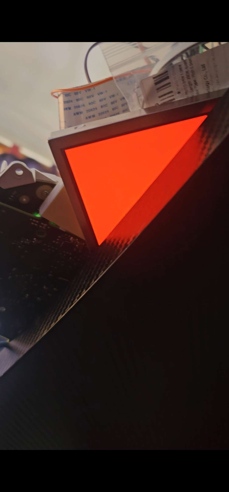
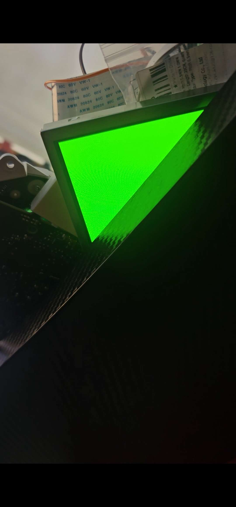
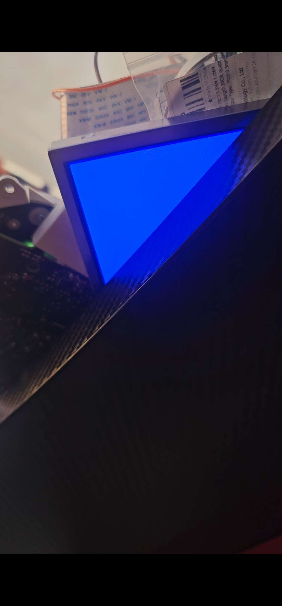

# Cluster2HDMI
A project dedicated to utilising a 7 inch LCD panel as a standalone monitor via a HDMI-parallel RGB converter and a Pico 2 fitted on a custom PCB

I have been reverse engineering a 7" LCD panel that I pulled out of a vehicle dashboard, in hopes of using it as a standalone monitor. So far I have mapped every pin on the 45-pin video connector, and the next step is designing and ordering a PCB to drive it.

  
  
  

  

## Why I made this

This panel comes from an Audi Q7 instrument cluster (dashboard). Prior to this, I was able to control the entire dashboard via the CAN protocol. After that, I had the dream of being able to control the LCD entirely independently. I have always found it interesting reverse engineering things and making them work how I want, so I believed this project would be a great start, and so far it has.

## What it does

In the end, I aim to have this work as a standalone monitor, working via converting HDMI to parallel RGB, with a 12V PSU powering both the panel and its backlight, and rerouting specific pins to the panel, in order to make it work.

## How it works

From my computer, a HDMI cable will be plugged into a custom PCB, where it is converted to parallel RGB, before the video-specific pins (RGB, HSYNC, VSYNC, PCLK, etc.) will be routed to the correct pins connected to the panel. A Pico 2 will replicate the SPI setup commands the dashboard originally sends to the panel, and control the backlight brightness. The 12V supply will also power the panel's logic through a 3.3V regulator, and the backlight through a constant-current LED driver.

## Reverse engineering the panel

Originally, I had tried to search for datasheets available for my panel, but this was to no avail. There is not a single public datasheet available on the internet, which meant I had to reverse engineer it myself entirely. I began by connecting the dashboard's ribbon to one FFC breakout board and the panel's flex to another, with jumper wires between them, so I could probe every pin for continuity and voltage with a multimeter while the panel was running. Many problems were met here, more in the [journal](JOURNAL.md).

### Pin map (45-pin, 0.5 mm FPC)

Numbers are the breakout board labels.

| Label | Function | Notes |
|---|---|---|
| 1, 2, 13, 22, 31, 33, 37, 44, 45 | Ground | |
| 3 | Unknown | 1.5 kΩ pull-down to ground on the cluster side |
| 4, 38 | Power in | Supplied by the cluster (voltage to be confirmed) |
| 5–12 | Blue B0–B7 | 5 = least significant bit |
| 14–21 | Green G0–G7 | 14 = least significant bit |
| 23–30 | Red R0–R7 | 23 = least significant bit |
| 32 | PCLK | Pixel clock |
| 34 | HSYNC | |
| 35 | VSYNC | |
| 36 | DE | Data enable |
| 39, 43 | Not connected | Function unknown |
| 40 | SPI data (MOSI) | Setup commands |
| 41 | SPI chip select | Active low |
| 42 | SPI clock | |

### Video timing (measured from the cluster)

| | Value |
|---|---|
| Resolution | 800 × 480 |
| Pixel clock | ~26.8 MHz (cluster), 25 MHz (my Pico driver) |
| Horizontal | HSYNC 10 px, back porch 6 px, active 800 px, front porch 106 px, total 922 px |
| Vertical | active 480 lines, front porch 8, VSYNC 4, back porch 8, total 500 lines |
| Refresh rate | ~58 Hz (cluster), ~54 Hz (Pico) |
| Sync polarity | HSYNC and VSYNC active low, DE active high |

### SPI setup sequence

3-wire SPI, mode 0, MSB first, ~500 kHz, chip select active low.
Starts ~25 ms after video starts. Without it the panel stays black.

| Step | Bytes (hex) | Delay after |
|---|---|---|
| 1 | 1B 50 00 | 2.15 ms |
| 2 | 1D 5C 00 | 2.15 ms |
| 3 | 10 00 | 2.15 ms |
| 4 | 08 80 | ~125.6 ms |
| 5 | 14 80 | |

The cluster repeats the whole set every ~545.6 ms. What each register does is unknown.

## Current status

Currently, I am able to display full-screen solid colours on the panel from the Pico: red, green and blue, as well as other colours such as cyan, magenta, white, etc. (6 bits per colour). The panel's power and backlight still come from the cluster. Next is to properly power the panel via my own power supply from a custom PCB, and be able to use it as a standalone monitor connected to my computer via HDMI.

## Wiring (current test setup)

Breakout A = panel side, Breakout B = cluster side. Numbers are the breakout labels.

### Timing and SPI

| Pico 2 | Breakout A | Signal |
|---|---|---|
| GP0 | 32 | PCLK |
| GP1 | 36 | DE |
| GP2 | 34 | HSYNC |
| GP27 | 35 | VSYNC |
| GP28 | — | Not connected (used internally by the Pico) |
| GP21 | 42 | SPI clock |
| GP22 | 40 | SPI data (MOSI) |
| GP26 | 41 | SPI chip select |
| GND | Ground rail | Ground |

### Colour data (top 6 bits of each colour)

| Colour | Bit | Breakout A | Pico 2 |
|---|---|---|---|
| Blue | B2 | 7 | GP5 |
| Blue | B3 | 8 | GP6 |
| Blue | B4 | 9 | GP7 |
| Blue | B5 | 10 | GP8 |
| Blue | B6 | 11 | GP3 |
| Blue | B7 | 12 | GP9 |
| Green | G2 | 16 | GP12 |
| Green | G3 | 17 | GP13 |
| Green | G4 | 18 | GP14 |
| Green | G5 | 19 | GP4 |
| Green | G6 | 20 | GP15 |
| Green | G7 | 21 | GP10 |
| Red | R2 | 25 | GP18 |
| Red | R3 | 26 | GP19 |
| Red | R4 | 27 | GP20 |
| Red | R5 | 28 | GP11 |
| Red | R6 | 29 | GP16 |
| Red | R7 | 30 | GP17 |

### Resistors to ground

| Breakout A | Resistor | Why |
|---|---|---|
| 3 | 1 kΩ | Stands in for the cluster's 1.5 kΩ pull-down |
| 5, 6 | 2.2 kΩ each | Blue B0–B1 held low (unused) |
| 14, 15 | 2.2 kΩ each | Green G0–G1 held low (unused) |
| 23, 24 | 2.2 kΩ each | Red R0–R1 held low (unused) |

### Cluster to panel (breakout B → breakout A)

| Connection | Purpose |
|---|---|
| B4 → A4 | Panel power from the cluster |
| B38 → A38 | Panel power from the cluster |
| A1, 2, 13, 22, 31, 33, 37, 44, 45 → ground rail | Panel grounds |
| B1, 22, 44 → ground rail | Cluster ground |
| A39, A43 | Left unconnected |
| 10-pin backlight ribbon | Stays plugged into the cluster |

Power order: cluster on first, then plug in the Pico.

## Hardware

Coming once PCB is designed

## Firmware

Currently, the Pico code is MicroPython, written and run through Thonny. It generates the timing signals (PCLK, HSYNC, VSYNC, DE) using the Pico's PIO hardware, sends the SPI setup sequence, and controls the red, green and blue bits. The test firmware was written with help from Claude (AI). In the future, it will only be doing the SPI sequence and backlight control on the PCB, as the HDMI-parallel RGB converter will be responsible for the timing and colour bits. Code can be found [here](Firmware)

## How to flash

1. Holding BOOTSEL, plug in your Pico, and drag the [MicroPython .uf2 file](https://micropython.org/download/RPI_PICO2/) onto the drive that appears.
2. Open Thonny and choose the Pico as the interpreter, before saving the [firmware](Firmware) file onto the Pico as "main.py". After this, it'll run automatically on power-up. 
3. Turn on the cluster first, then turn on the Pico. You are done!

## Known issues

* Pins 3, 39 and 43's functions are unknown
* Exactly what each SPI register does is unknown, but easily replicable
* Unknown whether the panel needs SPI commands repeated
* Panel's power and backlight still come from the cluster
* 10-pin backlight connector hasn't been reverse-engineered yet
* Pico test driver uses 6 bits per colour, not 8, and can only show solid colours
* Loose wiring can cause unexpected disconnections

## Building one yourself

Coming once the PCB is finished.

## Bill of materials

| Part | Qty | Est. cost (AUD) | Link | Description |
|---|---|---|---|---|
| **Main parts** | | | | |
| Adafruit TFP401 HDMI/DVI decoder (no touch) | 1 | 55 | [Adafruit](https://www.adafruit.com/product/2219) | Converts HDMI to 24-bit parallel RGB |
| PCB fabrication + assembly of FPC connectors | 1 order | 30–50 | [JLCPCB](https://jlcpcb.com) | Custom adapter/driver board |
| 12 V power supply | 1 | 33 | [Amazon](https://www.amazon.com.au/dp/B0CRGJ15HS) | Main power input |
| Raspberry Pi Pico 2 | 1 | owned | [Raspberry Pi](https://www.raspberrypi.com/products/raspberry-pi-pico-2/) | SPI setup commands + backlight control |
| Audi Q7 4M0 920 781 A instrument cluster | 1 | owned | [eBay](https://www.ebay.co.uk/itm/177800811902) | Source of the 7" 800×480 LCD panel |
| **Connectors** | | | | |
| Hirose FH34SRJ-45S-0.5SH 45-pin FPC connector | 2 | 5 | [LCSC C3170034](https://www.lcsc.com/product-detail/C3170034.html) | Panel connector |
| XUNPU FPC-05FB-40PH20 40-pin FPC connector | 2 | 5 | [LCSC C2856837](https://www.lcsc.com/product-detail/C2856837.html) | TFP401 ribbon connector |
| 40-pin 0.5 mm FFC cable, 100 mm, type A | 1 | 5 | [LCSC C2859463](https://www.lcsc.com/product-detail/C2859463.html) | TFP401 board to PCB |
| 10-pin FPC connector | 1 | 2 | [link] | Backlight connector (pitch to be confirmed) |
| DC-005 barrel jack | 1 | 1 | [LCSC C16214](https://www.lcsc.com/product-detail/C16214.html) | 12 V input |
| BOOMELE 1×20 2.54 mm female header | 2 | 2 | [LCSC C50984](https://www.lcsc.com/product-detail/C50984.html) | Socket for the Pico 2 |
| **12 V input protection** | | | | |
| TECHFUSE mSMD110-16V resettable fuse | 1 | 1 | [LCSC C69691](https://www.lcsc.com/product-detail/C69691.html) | 1.1 A, protects against shorts |
| SS34 Schottky diode | 1 | 1 | [LCSC C8678](https://www.lcsc.com/product-detail/C8678.html) | Reverse-polarity protection |
| **5 V supply** | | | | |
| TPS54202 buck converter | 1 | 1 | [LCSC C191884](https://www.lcsc.com/product-detail/C191884.html) | 12 V → 5 V for the TFP401 board and Pico |
| Sunlord SWPA6045S100MT 10 µH inductor | 1 | 1 | [LCSC C79272](https://www.lcsc.com/product-detail/C79272.html) | For the buck converter |
| 100 kΩ 1% 0805 resistor | 2 | <1 | [LCSC C149504](https://www.lcsc.com/product-detail/C149504.html) | Buck feedback (top) + MOSFET gate pull-down |
| 13 kΩ 1% 0805 resistor | 1 | <1 | [LCSC C17455](https://www.lcsc.com/product-detail/C17455.html) | Buck feedback (bottom), sets ~5.18 V |
| **3.3 V supply** | | | | |
| AMS1117-3.3 regulator | 1 | 1 | [LCSC C6186](https://www.lcsc.com/product-detail/C6186.html) | 3.3 V for the panel logic |
| **Capacitors (shared)** | | | | |
| 10 µF 25 V X5R 0805 capacitor | 4 | <1 | [LCSC C15850](https://www.lcsc.com/product-detail/C15850.html) | Buck input ×2, 3.3 V input, panel bypass |
| 22 µF 25 V X5R 0805 capacitor | 3 | <1 | [LCSC C45783](https://www.lcsc.com/product-detail/C45783.html) | Buck output ×2, 3.3 V output |
| 100 nF 50 V X7R 0805 capacitor | 3 | <1 | [LCSC C49678](https://www.lcsc.com/product-detail/C49678.html) | Buck input bypass, bootstrap, panel bypass |
| **Backlight driver** | | | | |
| TPS61169 LED driver | 1 | 2 | [LCSC C71045](https://www.lcsc.com/product-detail/C71045.html) | Boost driver for the backlight |
| Sunlord SWPA6045S220MT 22 µH inductor | 1 | 1 | [LCSC C83454](https://www.lcsc.com/product-detail/C83454.html) | For the LED driver |
| SS16 Schottky diode | 1 | 1 | [LCSC C84578](https://www.lcsc.com/product-detail/C84578.html) | For the LED driver |
| 4.7 µF 25 V X5R 0805 capacitor | 1 | <1 | [LCSC C1779](https://www.lcsc.com/product-detail/C1779.html) | LED driver input |
| 1 µF 50 V X7R 1206 capacitor | 1 | <1 | [LCSC C1848](https://www.lcsc.com/product-detail/C1848.html) | LED driver output |
| 5.1 Ω 1% 0805 resistor | 1 | <1 | [LCSC C17724](https://www.lcsc.com/product-detail/C17724.html) | Sets backlight current (~40 mA, to be confirmed) |
| NSI45020 constant-current regulator | 2 | 2 | [LCSC C129159](https://www.lcsc.com/product-detail/C129159.html) | One per LED string (may not be needed) |
| AO3400A MOSFET | 1 | 1 | [LCSC C20917](https://www.lcsc.com/product-detail/C20917.html) | PWM dimming (may not be needed) |
| **Panel signals** | | | | |
| 1.5 kΩ 1% 0805 resistor | 1 | <1 | [LCSC C4310](https://www.lcsc.com/product-detail/C4310.html) | Pin 3 pull-down, copies the cluster |
| 33 Ω 1% 0805 resistor | 1 | <1 | [LCSC C17634](https://www.lcsc.com/product-detail/C17634.html) | PCLK series resistor |
| **Indicator** | | | | |
| Green 0805 LED | 1 | <1 | [LCSC C2297](https://www.lcsc.com/product-detail/C2297.html) | Power indicator |
| 1 kΩ 1% 0805 resistor | 1 | <1 | [LCSC C17513](https://www.lcsc.com/product-detail/C17513.html) | LED current limit |
| **Total** | | **~150-175** (excl. owned parts and shipping) | | |

## Credits & references

- [LogicAnalyzer by gusmanb](https://github.com/gusmanb/logicanalyzer)
- [Adafruit TFP401 HDMI/DVI decoder](https://www.adafruit.com/product/2219)
- Claude (AI): helped write the test firmware and decode the logic analyser captures

## Licence

MIT, see [LICENSE](LICENSE).
